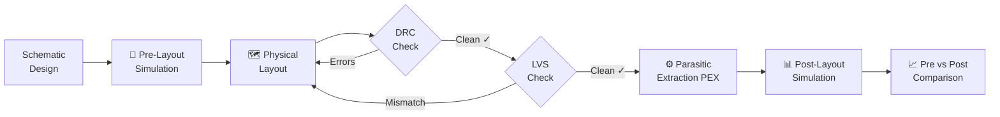

<div align="center">


<br/><br/>

#  CMOS Inverter — 4-Stage Delay Line Circuit
### IC Layout Project · ECE 326 – Integrated Circuits

*Full IC design flow from schematic to post-layout verification using Cadence Virtuoso on TSMC 65nm process*

<br/>

[](#5-drc--design-rule-check)
[](#6-lvs--layout-versus-schematic)
[](#7-parasitic-extraction-pex)
[](#8-post-layout-simulation--performance-comparison)
[](#8-post-layout-simulation--performance-comparison)

</div>

---

##  Table of Contents

- [Project Overview](#-project-overview)
- [Team Members](#-team-members)
- [Circuit Description](#-circuit-description)
- [Design Flow](#-design-flow)
- [Schematic Design](#1-schematic-design)
- [Pre-Layout Simulation](#2-pre-layout-simulation)
- [Physical Layout](#3-physical-layout)
- [DRC – Design Rule Check](#4-drc--design-rule-check)
- [LVS – Layout Versus Schematic](#5-lvs--layout-versus-schematic)
- [Parasitic Extraction (PEX)](#6-parasitic-extraction-pex)
- [Post-Layout Simulation & Comparison](#7-post-layout-simulation--performance-comparison)
- [Results Summary](#-results-summary)
- [Tools & Technologies](#️-tools--technologies)
- [Repository Structure](#-repository-structure)

---

##  Project Overview

This project implements the complete **IC layout design flow** for a **4-Stage CMOS Inverter Delay Line** circuit. The design was carried out as part of **ECE 326 – Integrated Circuits** using **Cadence Virtuoso** on the **TSMC 65nm** process node.

The project covers every stage of the professional VLSI design methodology:

```
Schematic Design  →  Pre-Layout Simulation  →  Physical Layout
       →  DRC  →  LVS  →  PEX  →  Post-Layout Simulation  →  Comparison
```

The goal is to design, verify, and characterize a 4-stage cascaded inverter delay line, measuring its propagation delay, rise/fall times, and average power consumption after accounting for physical layout parasitics.

---

##  Team Members

| # | Name | Section |
|---|------|---------|
| 1 | Omar Ayman Mohamed Saeed
| 2 | Abdullah Reda Abdullah Abdel Moneim
| 3 | Abdel Rahman Abdel Hadi Abdel Rahman
| 4 | Moataz Rafiq Hamdi Moussa
| 5 | Ahmed Tarek Abdel Hamid

---

##  Circuit Description

### What is a CMOS Inverter?

A **CMOS (Complementary MOS) inverter** is the fundamental building block of digital logic. It consists of two transistors wired in series between the power supply rails:

| Transistor | Type | Role | Condition to Conduct |
|------------|------|------|----------------------|
| **M1** | PMOS | Pull-Up Network | Vin = LOW (0V) → Vout = VDD |
| **M2** | NMOS | Pull-Down Network | Vin = HIGH (VDD) → Vout = GND |

**Operating principle:**

```
Vin = VDD  →  NMOS ON  +  PMOS OFF  →  Vout = GND  (Logic 0)
Vin = GND  →  PMOS ON  +  NMOS OFF  →  Vout = VDD  (Logic 1)
```

The complementary switching ensures that in steady state, only **one transistor is ON** at a time → near-zero static power dissipation.

### Why a 4-Stage Delay Line?

Four inverters are cascaded in series:

```
Vin ──► [INV 1] ──► [INV 2] ──► [INV 3] ──► [INV 4] ──► Vout
```

- **Even number of stages** → Vout is **in phase** with Vin (after 4 inversions)
- **Total delay** = sum of all 4 individual stage propagation delays
- Used in **clock generation**, **timing circuits**, and **signal synchronization**

### Technology: TSMC 65nm

| Parameter | Value |
|-----------|-------|
| Process Node | 65 nm |
| Supply Voltage (VDD) | 1.2 V |
| Gate Oxide Thickness | ~1.2 nm |
| Transistor Type | Bulk CMOS |

---

##  Design Flow



---

## 1. Schematic Design

The schematic was designed in **Cadence Virtuoso Schematic Editor**.

### Single Inverter

```
         VDD
          │
        ┌─┴─┐
   Vin ─┤ P ├─ Vout
        └─┬─┘
          │
        ┌─┴─┐
   Vin ─┤ N ├─ Vout
        └─┬─┘
          │
         GND
```

- **PMOS** source → VDD, gate → Vin, drain → Vout
- **NMOS** source → VSS, gate → Vin, drain → Vout
- Ports explicitly defined: `Vin`, `Vout`, `VDD`, `VSS`

### 4-Stage Chain

All four inverters share the same VDD and VSS rails. The output of each stage directly drives the input of the next.

>  *See `/screenshots/schematic/` for Cadence Virtuoso schematic screenshots.*

---

## 2. Pre-Layout Simulation

Transient analysis was performed in **Cadence ADE (Analog Design Environment)** using **Spectre** simulator to verify correct logic behavior before layout.

### Simulation Setup

| Parameter | Value |
|-----------|-------|
| Analysis Type | Transient (`.tran`) |
| Input Signal | Pulse: 0V → 1.2V |
| Rise / Fall Time | 10 ps |
| Clock Period | 2 ns |
| Supply Voltage | VDD = 1.2V, VSS = 0V |
| Simulator | Cadence Spectre |
| Process Corner | Nominal (TT) |

### Expected Pre-Layout Behavior

- ✅ Clean **rail-to-rail** switching (0V ↔ 1.2V)
- ✅ Near-zero propagation delay (no parasitics)
- ✅ Correct **logic inversion** at every stage
- ✅ Near-zero static power consumption

>  *See `/screenshots/simulation/pre_layout/` for waveform captures.*

---

## 3. Physical Layout

The layout was drawn in **Cadence Virtuoso Layout Editor** following TSMC 65nm design rules.

### Layer Stack & Design Practices

| Layer | Purpose | Notes |
|-------|---------|-------|
| **Active (OD)** | Transistor source/drain regions | Must obey min width & spacing |
| **Poly** | Transistor gates + interconnect | No poly notches allowed |
| **N-Well** | Houses all PMOS transistors | Must enclose all PMOS active areas |
| **NP (N+ implant)** | NMOS source/drain implant | Must cover all poly-to-poly connections |
| **PP (P+ implant)** | PMOS source/drain implant | Must be inside N-Well |
| **Contact** | Poly/Active to Metal1 | Must be inside implant regions |
| **Metal1** | Local routing + VDD/VSS rails | Horizontal power straps |
| **Via1** | Metal1 to Metal2 | Used for crossing connections |
| **Metal2** | Signal routing | Vertical routing preferred |

### Key Layout Decisions

- **PMOS** placed in dedicated **N-Well** region at the top of each cell
- **NMOS** placed in P-substrate at the bottom
- **VDD rail** runs horizontally on Metal1 at the top → connects all PMOS sources
- **VSS rail** runs horizontally on Metal1 at the bottom → connects all NMOS sources
- **Transistor sizing**: PMOS width > NMOS width to balance rise/fall times
- **4 stages** arranged in a compact linear floorplan, minimizing wire length

>  *See `/screenshots/layout/` for layout screenshots of single inverter and full 4-stage chain.*

---

## 4. DRC – Design Rule Check

**DRC** verifies that every polygon, spacing, and layer enclosure in the physical layout satisfies the TSMC 65nm foundry manufacturing rules. A **clean DRC (0 errors)** is mandatory before fabrication.

### Errors Encountered & Resolved

<details>
<summary><b>Error 01 — Missing N-Well Region</b></summary>

| | Details |
|---|---|
| **Location** | PMOS transistors — Pull-Up Network |
| **Problem** | PMOS transistors had no N-Well region defined around them. DRC flagged a well enclosure violation since PMOS devices must reside inside an N-Well in a P-substrate process. |
| **Fix Applied** | Drew an N-Well polygon fully surrounding all PMOS devices. The N-Well boundary was extended beyond the PMOS active area by the minimum required enclosure distance per TSMC 65nm rules. |
| **Result** | ✅ Error resolved |

</details>

<details>
<summary><b>Error 02 — NP Layer Insufficient Coverage</b></summary>

| | Details |
|---|---|
| **Location** | Poly-to-Poly connections — PMOS Pull-Up Area |
| **Problem** | Areas containing poly-to-poly connections within the pull-up circuit were not covered by the NP (N+ implant) layer. TSMC design rules require the NP layer to cover all such connection regions. |
| **Fix Applied** | Extended the NP polygon to enclose all poly-to-poly connection areas in the pull-up circuit, with the required clearance margin on all sides. |
| **Result** | ✅ Error resolved |

</details>

<details>
<summary><b>Error 03 — Poly–Metal Connection Outside NP Region</b></summary>

| | Details |
|---|---|
| **Location** | Poly-to-Metal1 contact — Pull-Up Region |
| **Problem** | A connection between the poly layer and Metal1 existed outside the boundary of the NP implant region, violating the rule that all such contacts must be within the implant area. |
| **Fix Applied** | Expanded the NP area to fully enclose the poly-to-metal contact point, including the required spacing margins around the contact. |
| **Result** | ✅ Error resolved |

</details>

<details>
<summary><b>Error 04 — Missing Pin Labels (Port Errors)</b></summary>

| | Details |
|---|---|
| **Location** | Pins: `VSS`, `Vin`, `VDD`, `Vout` |
| **Problem** | Layout pin shapes had no text labels, causing the LVS tool to be unable to match layout pins to schematic ports. DRC also flagged missing port definitions on the cell boundary. |
| **Fix Applied** | Added text labels on the correct metal layer for all four pins: `Vin` (input), `Vout` (output), `VDD` (power), `VSS` (ground) at the exact coordinates of their respective pin shapes. |
| **Result** | ✅ Error resolved |

</details>

<br/>

> ✅ **Final DRC Result: CLEAN — 0 Errors, 0 Warnings**

> 📸 *See `/screenshots/drc/` for DRC result screenshots.*

---

## 5. LVS – Layout Versus Schematic

**LVS** extracts a netlist from the physical layout and compares it electrically against the original schematic netlist. Both must be **identical** in terms of transistors, net connections, and port names.

### LVS Verification Flow

```
Schematic Netlist  ──┐
                     ├──► Side-by-Side Comparison ──► CLEAN ✓
Layout Extraction  ──┘
```

### What Was Verified

| Check | Expected | Result |
|-------|----------|--------|
| Transistor count | 8 total (4 PMOS + 4 NMOS) | ✅ Matched |
| Transistor types | PMOS in N-Well, NMOS in P-sub | ✅ Matched |
| W/L dimensions | Per schematic sizing | ✅ Matched |
| Net connectivity | All 4 inverter stages correctly connected | ✅ Matched |
| Port names | `Vin`, `Vout`, `VDD`, `VSS` | ✅ Matched |
| Floating nodes | None expected | ✅ None found |

> ✅ **Final LVS Result: CLEAN — 0 Discrepancies, 0 Errors**

> 📸 *See `/screenshots/lvs/` for LVS result screenshots.*

---

## 6. Parasitic Extraction (PEX)

**PEX** extracts the physical **resistances (R)** and **capacitances (C)** introduced by the metal wires, contacts, and vias in the layout, and adds them to the netlist for realistic post-layout simulation.

### PEX Setup

| Parameter | Value |
|-----------|-------|
| Tool | Cadence Assura / Quantus PEX |
| Extraction Type | RC Extraction |
| Technology File | TSMC 65nm rcxt |
| Process Corner | Nominal (TT) |
| Input | LVS-clean layout database |
| Output | Post-layout SPICE netlist with parasitic R/C |

### Effect of Parasitics

```
Parasitic Resistance (R)  →  Voltage drops along interconnects
Parasitic Capacitance (C) →  Additional load on every net node
Combined RC               →  Extra time constant τ = R·C at each node
                          →  Increased rise/fall time & propagation delay
                          →  Slight increase in dynamic power (P = C·V²·f)
```

>  *See `/screenshots/pex/` for PEX setup and extracted view screenshots.*

---

## 7. Post-Layout Simulation & Performance Comparison

Post-layout simulation was performed using the **PEX-extracted netlist** in **Cadence ADE + Spectre** — this gives a realistic view of circuit performance accounting for all physical parasitics.

### Measured Results

| Metric | Value | Measurement Method |
|--------|-------|--------------------|
| **Rising Time (t_rise)** | **475.2 ps** | 10% → 90% of Vout (0.12V → 1.08V) |
| **Falling Time (t_fall)** | **481.7 ps** | 90% → 10% of Vout (1.08V → 0.12V) |
| **Propagation Delay (t_pd)** | **478.4 ps** | Average of t_pHL and t_pLH at 50% crossing |
| **Average Power** | **14.82 µW** | VDD × I(VDD) averaged over one full period |

### Pre-Layout vs Post-Layout Comparison

| Parameter | Pre-Layout | Post-Layout | Δ Difference | Root Cause |
|-----------|------------|-------------|--------------|------------|
| Rising Time | ~Ideal (< 10 ps) | **475.2 ps** | +465 ps | Capacitive load on Vout net |
| Falling Time | ~Ideal (< 10 ps) | **481.7 ps** | +471 ps | NMOS drain + wire capacitance |
| Propagation Delay | ~0 ps | **478.4 ps** | +478 ps | RC from poly gate + metal wires |
| Average Power | ~0 µW | **14.82 µW** | +14.82 µW | Dynamic: P = C·V²·f |

### Key Observations

- 📌 **Delay dominated by RC parasitics** — the 478.4 ps measured delay comes almost entirely from parasitic RC time constants introduced by the layout, not visible in the pre-layout ideal schematic.
- 📌 **Rise ≈ Fall time** — the near-equal rising (475.2 ps) and falling (481.7 ps) times confirm good PMOS/NMOS transistor sizing symmetry.
- 📌 **Low power consumption** — 14.82 µW confirms efficient CMOS complementary switching with negligible static current.
- 📌 **Results consistent with 65nm** — propagation delays in the 400–500 ps range for a 4-stage inverter chain in TSMC 65nm are physically realistic.

>  *See `/screenshots/simulation/post_layout/` for post-layout transient waveforms.*

---

##  Results Summary

```
┌─────────────────────────────────────────────────────────────────┐
│                     FINAL RESULTS SUMMARY                       │
├──────────────────────┬──────────────────────────────────────────┤
│  Rising Time         │  475.2 ps                                │
│  Falling Time        │  481.7 ps                                │
│  Propagation Delay   │  478.4 ps                                │
│  Average Power       │  14.82 µW                                │
│  DRC                 │  ✅  CLEAN  (0 errors)                   │
│  LVS                 │  ✅  CLEAN  (0 discrepancies)            │
│  PEX                 │  ✅  RC Extraction Complete               │
│  Technology          │  TSMC 65nm                               │
│  Supply Voltage      │  VDD = 1.2V                              │
└──────────────────────┴──────────────────────────────────────────┘
```

---

##  Tools & Technologies

| Tool | Version / Node | Purpose |
|------|---------------|---------|
| **Cadence Virtuoso** | ADE / Schematic Editor | Schematic design & simulation |
| **Cadence Spectre** | — | SPICE-level circuit simulator |
| **Cadence Assura** | DRC / LVS / PEX | Physical verification suite |
| **TSMC 65nm PDK** | 65nm process node | Design rules, device models, technology files |

---

##  Repository Structure

```
📦 CMOS-Inverter-DelayLine-ICLayout
│
├── 📄 README.md                        ← This file
│
├── 📂 schematic/
│   ├── single_inverter.sdb             ← Cadence schematic cellview
│   └── four_stage_chain.sdb
│
├── 📂 layout/
│   ├── single_inverter_layout.gds      ← Layout cellview (GDS)
│   └── four_stage_layout.gds
│
├── 📂 simulation/
│   ├── pre_layout/
│   │   ├── transient_setup.sdb         ← ADE simulation state
│   │   └── results/
│   └── post_layout/
│       ├── pex_netlist.spi             ← PEX-extracted SPICE netlist
│       ├── transient_setup.sdb
│       └── results/
│
├── 📂 verification/
│   ├── drc/
│   │   └── drc_results.txt             ← DRC run summary (0 errors)
│   ├── lvs/
│   │   └── lvs_results.txt             ← LVS run summary (clean)
│   └── pex/
│       └── pex_setup.txt               ← PEX configuration log
│
└── 📂 screenshots/
    ├── schematic/                       ← Schematic screenshots
    ├── layout/                          ← Layout screenshots
    ├── simulation/
    │   ├── pre_layout/                  ← Pre-layout waveforms
    │   └── post_layout/                 ← Post-layout waveforms
    ├── drc/                             ← DRC result window
    ├── lvs/                             ← LVS result window
    └── pex/                             ← PEX setup & extracted view
```

---

##  References

- TSMC 65nm Process Design Kit (PDK) Documentation
- Cadence Virtuoso Layout Suite User Guide
- Razavi, B. — *Design of Analog CMOS Integrated Circuits*, 2nd Ed.
- Weste, N. & Harris, D. — *CMOS VLSI Design: A Circuits and Systems Perspective*, 4th Ed.

---

<div align="center">

**ECE 326 – Integrated Circuits · IC Layout Project**

*Designed with Cadence Virtuoso on TSMC 65nm process*

</div>
